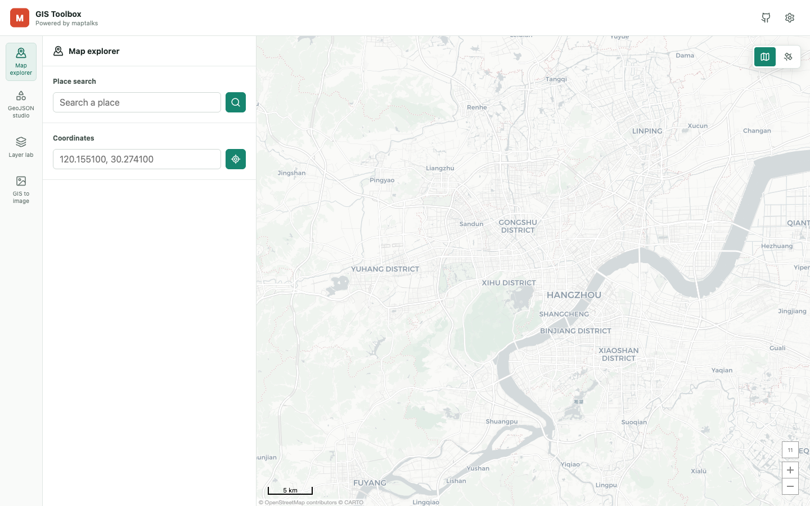

# GIS 地图工具箱

<!-- repo-languages:start -->
[English](README.md) | 简体中文
<!-- repo-languages:end -->

<!-- repo-badges:start -->
[](https://nodejs.org)
[](https://pnpm.io)
[](https://react.dev)
[](https://vite.dev)
[](https://www.typescriptlang.org)
[](https://sass-lang.com)
[](https://codecov.io/gh/shenzhepei/maptalks-toolbox)
[](https://github.com/shenzhepei/maptalks-toolbox/blob/HEAD/LICENSE)
[](https://github.com/sponsors/shenzhepei)
<!-- repo-badges:end -->

一个基于 React、TypeScript 与 maptalks 的可扩展浏览器端 GIS 工具箱，支持地图探索、坐标转换、GeoJSON 可视化、服务调试与地图图片导出。项目使用 Vite 构建，并通过 SCSS 维护界面样式。

**[打开在线应用](https://shenzhepei.github.io/maptalks-toolbox/)**



## 功能

- 无需 API Key 即可打开并探索 maptalks 地图。
- 在英文与简体中文之间切换完整界面；首次访问默认使用英文，主动选择会保存在本地。
- 点击地图查看 WGS84 坐标，并转换为 GCJ-02、CGCS2000 和 BD-09。
- 切换标准底图与卫星底图。
- 绘制点、线和面，并复制生成的 GeoJSON。
- 将绘制的 GeoJSON 转换为 GCJ-02、WGS84、CGCS2000 或 BD-09 输出。
- 在所有工具间共享一个本地 GeoJSON 工作区，支持要素选择、重命名、撤销/重做、源码编辑、导入、复制和下载。
- 编辑点、线和面的颜色、线宽、填充透明度和点半径。
- 添加仅保存在浏览器本地的 XYZ、WMS 和 ArcGIS MapServer 自定义瓦片图层。
- 控制自定义图层显隐、透明度和顺序，并可随时移除，且不会影响其他工具。
- 在地图上测量距离和面积，并判断坐标是否位于选中的面内。
- 导入包含点、线或面的 GeoJSON `FeatureCollection` 文件。
- 将当前视图或选中区域按放大后的地图切片拼接为一张高分辨率 PNG。
- 通过带类型约束的注册表继续加入 GIS 服务适配器和 maptalks-gl 图层。

## 可选高德服务

地图、GeoJSON 工作区、自定义图层、测量和图片导出均不需要高德 Key。地点搜索继续作为可选高德服务提供；需要该能力的访问者可以从[高德开放平台控制台](https://console.amap.com/dev/key/app)填写自己的 **Web 端（JS API）Key** 和对应的**安全密钥**。

凭据保存在当前浏览器的 `localStorage` 中，直到访问者点击**清除**。凭据不会进入源代码、构建产物、分析服务或应用日志。按照高德 JavaScript API 的工作方式，浏览器仍会将凭据直接发送给高德服务。使用共享设备后请清除已保存的凭据。

使用在线应用时，请将 `https://shenzhepei.github.io` 加入 Key 的允许域名。本地开发时，请按照[高德准备工作指南](https://lbs.amap.com/api/javascript-api-v2/guide/abc/prepare)允许 `localhost`。

## 本地开发

需要 Node.js 24 和 pnpm 10.33.2。

```bash
corepack enable
pnpm install
pnpm dev
```

打开终端显示的本地地址即可使用地图；可在设置中配置高德可选服务。

## 质量检查

```bash
pnpm test:coverage
pnpm build
```

覆盖率统计 `src/lib` 下的生产模块，并生成 `coverage/lcov.info`。GitHub Actions 会在每次 push 和 pull request 时运行检查，并将报告上传到 Codecov。导出测试会创建真实的彩色 Canvas 分片、写入 IndexedDB、合成为 PNG，并检查最终像素不是空白且位置正确。

## 添加新功能

1. 在 `src/lib/features.ts` 中添加稳定 ID 和功能元数据。
2. 在 `src/components/*.tsx` 下实现 React 功能面板，并复用统一的 `MapRuntime` 接口。
3. 在 `src/App.tsx` 中挂载面板，将共享样式维护在 `src/styles.scss`，并为 `src/lib` 中的可复用逻辑添加聚焦测试。
4. 所有服务商凭据都使用浏览器本地的服务适配器流程。

这种结构只共享一个 maptalks 地图实例，同时让服务商能力和后续图层格式可以独立维护。

## 坐标系

在 maptalks 上绘制的图形和共享工作区数据统一使用 WGS84。GCJ-02 与 BD-09 转换使用 `gcoord`。地理坐标形式的 CGCS2000（EPSG:4490）在应用的 6 位小数精度下使用 WGS84 经纬度，适合普通 Web 地图数据交换，但不能替代测绘级基准转换。

RFC 7946 标准 GeoJSON 使用 WGS84。选择 GCJ-02、CGCS2000 或 BD-09 时，工具会保留 GeoJSON 结构并转换坐标值，因此数据使用方必须知道所选坐标系。

## GeoJSON 与导出说明

- GeoJSON 文件只在本地解析，本应用不会上传这些数据。
- 共享 GeoJSON 工作区、样式和坐标设置保存在 `localStorage` 中，切换工具不会丢失工作区数据。
- 自定义图层配置保存在 `localStorage` 中，请求只发送给所填写的瓦片服务。远程服务必须允许浏览器访问并提供兼容的 CORS 响应头；HTTPS 部署无法加载不安全的 HTTP 图层。
- 标准底图使用包含 OpenStreetMap 数据的 CARTO 瓦片，卫星模式使用 Esri World Imagery；对应服务的可用性、CORS、条款和署名要求仍然适用。
- 高分辨率导出会按所选细节级别逐格移动 maptalks 地图，直接读取渲染完成的地图 Canvas，并将每格 PNG Blob 写入临时 IndexedDB。完成采集后再逐格读取、拼接，删除临时数据库，恢复原地图视图，最后只下载一张 PNG。
- 浏览器安全限制为单边最多 16,384 像素、总像素最多 6400 万、最多采集 256 格；超出限制时请降低细节级别或缩小选区。
- 导入数据必须声明坐标系；内部工作区和 maptalks 渲染器统一使用 WGS84。

## 许可证

[MIT](LICENSE) © 2026 shenzhepei
